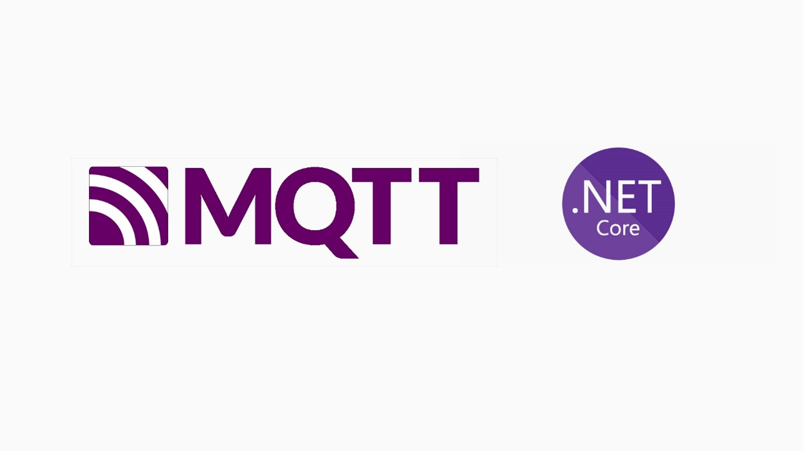

## MQTT .NET Core Tutorial Backend

Projeto backend de servidor com broker MQTT criado em .NET Core para receber conexões de dispositivos ESP32



### Execução

Para executar a aplicação digite no console:

```
      dotnet watch run

```


### Firmware ESP32

O projeto do firmware para ESP32 pode ser encontrado [aqui](https://github.com/Yago-Caetano/MQTT_NET_CORE_Tutorial__ESP_32_Firmware)
